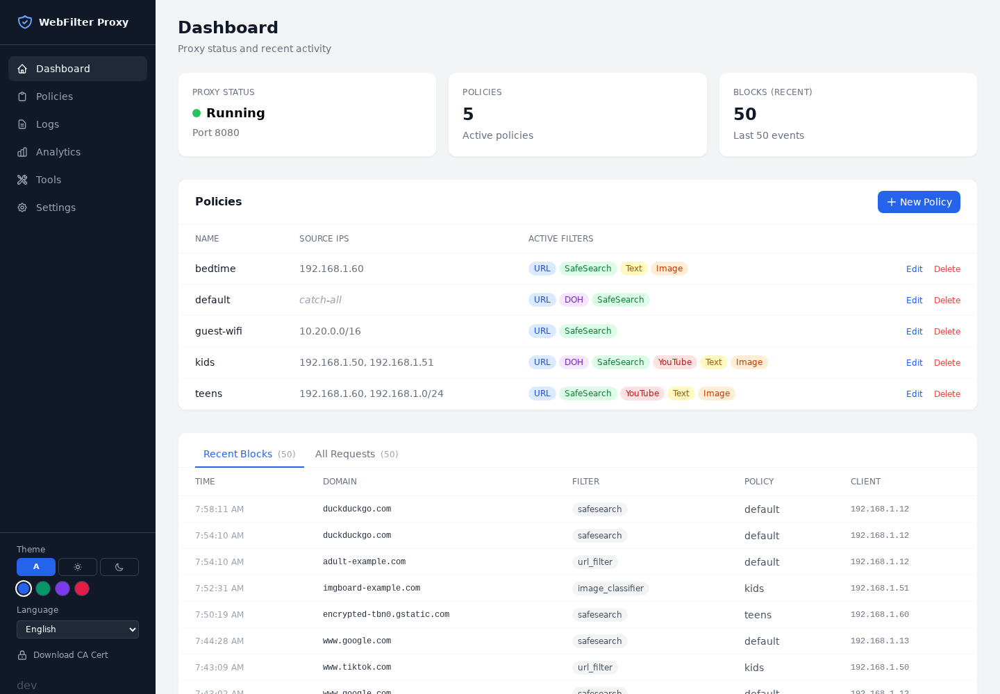

# gowebfilter

A single-binary, policy-based web-filtering proxy for a household or small
office network: MITM-intercepts HTTP/HTTPS traffic, applies per-client
(IP/MAC/CIDR) policies, and ships a browser-based management UI for
configuring everything. It is a from-scratch Go port of
[mitmproxy-web-filter](https://github.com/Yjlion/mitmproxy-web-filter),
aimed at replacing a Python + mitmproxy runtime with one static executable.

> **Vibe-coded disclaimer.** This project was built almost entirely through
> AI-assisted sessions with a human reviewing direction and testing rather
> than writing most of the code by hand. It has real test coverage and has
> been exercised against live traffic, but it has not had an independent
> human security audit. Treat it as a personal/homelab project, not audited
> security software.

## Screenshots

The management web UI — dashboard, policies, logs, analytics, tools and
settings — is in [screenshots/](screenshots/), rendered against generated
sample data. Regenerate with `bash scripts/capture_screenshots.sh`.

[](screenshots/)

## What it does

- **TLS-intercepting forward proxy**: generates its own CA, issues per-host
  leaf certificates on the fly, and filters decrypted HTTP/HTTPS traffic
  through an ordered addon pipeline.
- **Per-client policy routing**: policies match by MAC address, exact IP,
  CIDR range, or a catch-all default, using the same tiered matching as the
  Python original.
- **Filtering addons**: URL allow/blacklist with category blocklists,
  SafeSearch enforcement, YouTube channel filtering, DNS-over-HTTPS
  blocking, QUIC blocking, an embedded pure-Go Bayesian adult-text
  classifier, and a pure-Go embedded NSFW image classifier.
- **ICAP service**: an `icap@host:port` listener turns the same filtering
  into an adaptation service for a proxy you already run — Squid keeps its
  caching, ACLs, auth and TLS interception and hands each request and
  response over for a verdict. Verified against Squid in forward, ssl_bump,
  peek-and-splice and transparent-intercept modes; see
  [docs/icap.md](docs/icap.md).
- **Management UI**: policy editor, live logs/analytics, PAC file
  generation, neighbor/ARP scanning, and category list management.
- **Native desktop UI**: `webfilter gui` opens a native window
  (github.com/gogpu/ui — pure Go, GPU-rendered, still no CGO) covering the
  dashboard, policies, logs, and settings, with the web UI one click away
  for everything else.
- **Single binary**: no Python runtime, virtualenv, native ML runtime, or
  sidecar DLL to bundle; cross-compiles for Windows and Linux
  (x86_64/arm64) with `CGO_ENABLED=0`.

## Quick start

Building does not require CGO or a C toolchain.

```bash
go build -o webfilter.exe ./cmd/webfilter   # or `webfilter` on Linux

cp config/settings.example.json config/settings.json
cp policies/default.json.example policies/default.json

./webfilter.exe run --settings config/settings.json
```

Then open `http://127.0.0.1:8000` for the management UI, and point clients
at `127.0.0.1:8080` as their HTTP(S) proxy. Import `certs/ca.crt` into the
client's trust store to avoid TLS warnings once MITM starts intercepting.

`run` starts both the proxy engine and the management server in one
process. `webfilter proxy` and `webfilter mgmt` run them standalone if you
want process isolation.

`webfilter gui` opens the native desktop window instead: if nothing is
serving the management port it hosts the proxy + management server itself
(closing the window then stops filtering); if a server is already running
(`run`, the tray, or a service) it attaches to it and closing the window
changes nothing. Headless servers are unaffected — the GUI toolkit is
compiled in but only touches a display when you actually run `gui` (on
Linux that command needs X11/Wayland at runtime; building does not).

### In a container

```bash
docker compose up -d
```

The image is a static binary on Alpine, and the container bootstraps its own
`config/`, `policies/`, `certs/` and `logs/` into a single `/data` volume on
first start — there is nothing to copy first. See
[docs/docker.md](docs/docker.md) for the CA-install and blocklist steps.

## Building and testing

```bash
CGO_ENABLED=0 go build ./...
go vet ./...
go test ./...
```

See [HANDOFF.md](HANDOFF.md) for the full phase-by-phase build history,
what is verified vs. not, and architecture notes for anyone picking this
project back up. See [packaging/README.md](packaging/README.md) for running
it as a Windows service or Linux systemd unit.

## Models

- **Image (GantMan/nsfw_model)**: no setup needed. The model
  ([MobileNetV2, MIT-licensed](https://github.com/GantMan/nsfw_model)) is
  embedded directly in the binary (`internal/classify/image/model.bin`,
  ~8.6MB) and run by a from-scratch pure-Go inference engine. See
  `scripts/nsfw-model/README.md` for provenance and regeneration notes.
- **Text (embedded Bayesian scorer)**: no setup needed. A compact
  adult-text feature table is embedded in the binary and scored with a
  pure-Go Naive Bayes classifier. The seed vocabulary is curated from
  LDNOOBW's English list concepts with CC-BY-4.0 attribution; see
  `internal/classify/textbayes/NOTICE`.

Enable `image_classifier`/`text_classifier` on the policies that should use
them. Both default to disabled per-policy because NSFW classification false
positives have real cost and should be an explicit opt-in.

## Configuration

Config lives entirely on disk, matching the Python original's layout:

- `config/settings.json` - global settings. Most changes apply immediately;
  `PUT /api/settings` reports which ones still need a restart (see below).
  Set `mgmt_tls` to serve the management UI over HTTPS (below).
- `policies/*.json` - per-client policies. Hot-reloaded; edit via the UI or
  the file directly.
- `certs/` - generated CA + leaf certificate cache.
- `categories/` - domain-list blocklists refreshed by
  `webfilter categories update`.
- `logs/webfilter.db` - SQLite request/block log, browsable from the UI.

Runtime state is generated or copied from the shipped `.example` templates
and is not committed to the repo.

### What reloads without a restart

Policies hot-reload wholesale. Settings reload the fields whose consumers
read them per request - interface language, proxy authentication, the
management pseudo-hostname, ICAP tuning, PAC settings, management auth - and
the API tells you about the rest rather than making you guess:

```json
PUT /api/settings  ->  { ..., "restart_required": ["proxy_listen"] }
```

Still restart-only, because they are bound or opened once at startup:
`proxy_listen`, `mgmt_host`/`mgmt_port`, `cert_dir`, `logs_dir` and the
`log_*` options, `policies_dir`, and the `tun2socks`/`gateway` capture
modes. The settings page names them after a save.

This works whether the proxy and management server share a process
(`webfilter run`) or not: a standalone `webfilter proxy` picks up changes
written by a standalone `webfilter mgmt` through a filesystem watch.

### Management HTTPS

`mgmt_tls` serves the management UI and API over TLS, including the login
request. The certificate is either a pair you supply
(`mgmt_cert_file`/`mgmt_key_file` - the path for a publicly trusted
certificate) or one minted on demand by the runtime CA, the same issuer the
proxy uses for TLS-wrapped listeners.

One consequence of the CA-minted option is worth knowing before enabling
it: the CA download at `/api/ca-cert` is then itself served over HTTPS
signed by the CA the client has not installed yet, so the first fetch warns.
WPAD clients will likewise not fetch `/proxy.pac` from an endpoint they do
not trust. Install `certs/ca.crt` out of band first, supply a real
certificate, or leave `mgmt_tls` off if you distribute PAC from this port.

The Android app always serves its management UI over plain loopback HTTP
regardless of this setting - its WebView has no trust path to a CA-minted
leaf.

## Monitoring

The management server exposes two endpoints for operations:

- `GET /health` - liveness for load balancers and container healthchecks.
  Unauthenticated (a load balancer cannot log in) and deliberately cheap: no
  database queries, no port probes.
- `GET /metrics` - Prometheus text exposition: requests by action, blocks by
  component, classifier latency and outcomes, upstream errors, connection
  counts. No external exporter and no new dependencies.

See [docs/metrics.md](docs/metrics.md) for the full metric list, how to
scrape it when management auth is on, and the one real caveat (counters are
per-process, so scrape the process that serves traffic).
